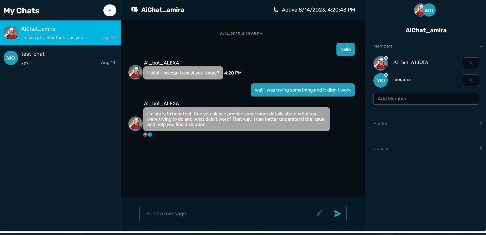

# ChatApp with OpenAI Integration 👥🤖

A dynamic chat application that lets you have conversations with other subscribed users and OpenAI-powered AI assistants. Seamlessly switch between conversations with real users and AI assistants based on the chat's name. Built using React, ChatEngine, and OpenAI, and supercharged with Vite.

## Features

- Have real-time conversations with subscribed app users.
- Utilize OpenAI for advanced conversations by starting your chat with specific prefixes:
  - To chat with OpenAI: Start the chat name with "AiChat_".
  - For code assistance: Begin the chat name with "AiCode_".
  - For general AI assistance: Use "AiAssist_" at the start of the chat name.
- Quick and dynamic conversation switching.
- Smooth and fast UI powered by Vite's blazing speed.

## Usage

1. **Log in or Sign Up**: Get started by logging in to your account or signing up if you're new to ChatApp.

2. **Start a New Chat**: Create a new chat by giving it a name that indicates your preferred chat type. For example:
   - To chat with OpenAI: Start the chat name with "AiChat_" (e.g., "AiChat_MyOpenAIChat").
   - For code assistance: Begin the chat name with "AiCode_" (e.g., "AiCode_ProjectHelp").
   - For general AI assistance: Use "AiAssist_" at the start of the chat name (e.g., "AiAssist_DailyTasks").

3. **Engage in Conversations**: Once you've created a chat, start typing your messages and see real-time updates as you converse with other users.

4. **AI Interactions**: To engage with AI-powered assistants, make sure your chat name follows the appropriate prefix pattern:
   - "AiChat_" for OpenAI conversations.
   - "AiCode_" for code assistance.
   - "AiAssist_" for general AI interactions.

5. **Seamless Conversations**: Enjoy smooth and seamless conversations with both real users and AI assistants. Switch between different chats effortlessly and make the most of your ChatApp experience.

